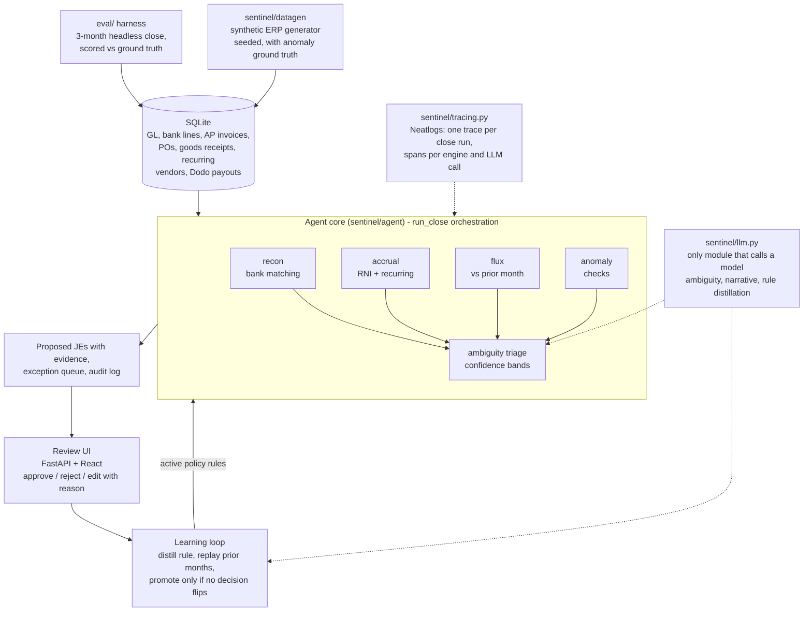
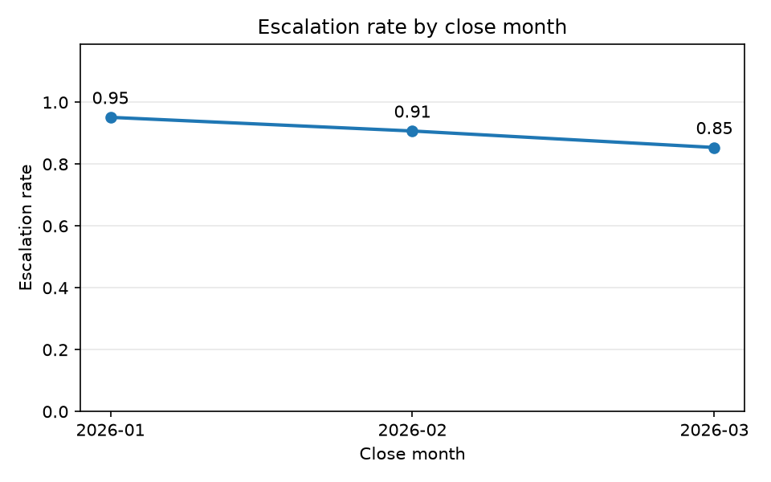
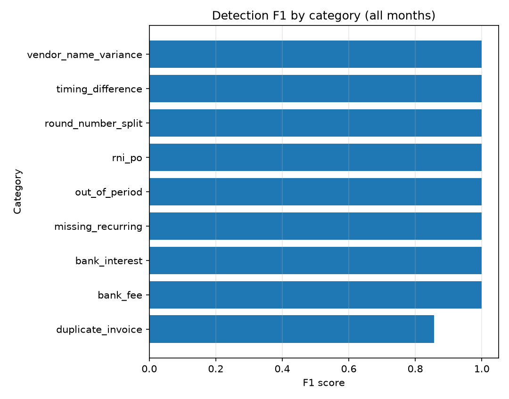

# Ledger Sentinel

An autonomous month-end close agent. Each period it runs bank reconciliation, accrual detection (received-not-invoiced purchase orders and missing recurring bills), flux analysis against the prior month, and anomaly checks (duplicate invoices, vendor name variance, round-number splits near approval limits, out-of-period postings) end to end, and escalates only genuine judgment calls to a human reviewer. Every human decision feeds a learning loop: the agent distills the resolution into a narrow, guardrailed policy rule, replays that rule against all prior months as a regression gate, and promotes it only if no previously correct decision flips. Promoted rules apply automatically next month, so the agent escalates less over time without losing accuracy.

**Core guarantee: every proposed journal entry carries an `evidence[]` list pointing at specific source rows (bank lines, invoices, GL entries, purchase orders). The `ProposedJE` schema rejects any entry with empty evidence or unbalanced lines, so a journal entry without evidence cannot exist anywhere in the system.**

## Architecture

The deterministic engines do the heavy lifting. Matching, accrual detection, flux computation, and anomaly checks are plain Python over SQL rows, unit tested against fixtures. The LLM is used only for ambiguity resolution, narrative, and rule distillation; it never invents journal entries, and the whole close completes without any model access (calls degrade to escalation).



- `sentinel/datagen`: seeded generator for a realistic three-month company (2026-01 to 2026-03) with 33 planted anomalies across 9 categories and a committed ground truth file.
- `sentinel/recon`, `sentinel/accrual`, `sentinel/flux`, `sentinel/anomaly`: deterministic engines. Recon also reconciles Dodo Payments payouts against bank deposits.
- `sentinel/agent`: `run_close` orchestrates the engines per period, triages proposed JEs into auto-approved or needs-review confidence bands, records exceptions, and writes an audit log for every action. `rules.py` implements the learning loop with the regression gate.
- `sentinel/llm.py`: the only module allowed to call a model. Uses the Anthropic SDK when `ANTHROPIC_API_KEY` is set, otherwise the local `claude` CLI in headless mode.
- `sentinel/api.py` + `web/`: FastAPI routes and a React review UI with tabs for exceptions, journal entries, metrics, and learned rules. The evidence endpoint serves only whitelisted source tables.
- `eval/`: headless three-month close with a simulated reviewer, scored against ground truth.
- `sentinel/tracing.py`: Neatlogs tracing over the run: one workflow trace per close, a span per engine, a span per LLM call.

## Running it

Requires Python 3.12+, [uv](https://docs.astral.sh/uv/), and Node.js.

```bash
uv sync
uv run python -m sentinel.datagen
SENTINEL_DB=data/sentinel.db uv run uvicorn sentinel.api:app
```

Then in a second terminal:

```bash
cd web
npm install
npm run dev
```

Open http://localhost:5173. The Vite dev server proxies API calls to the backend on port 8000. On Windows PowerShell, set the database path with `$env:SENTINEL_DB = "data/sentinel.db"` before starting uvicorn.

Kick off a close from the command line (the UI reviews results; it does not trigger runs):

```bash
curl -X POST http://127.0.0.1:8000/close/run -H "Content-Type: application/json" -d '{"period": "2026-01"}'
```

Tests and lint:

```bash
uv run pytest
uv run ruff check .
```

Full evaluation (regenerates `eval/results.json` and the charts):

```bash
uv run python -m eval.run --db data/eval.db --seed 42 --out eval/results.json
```

### Tracing

Put `NEATLOGS_API_KEY=...` in a `.env` file and start the server with `uv run uvicorn sentinel.api:app --env-file .env` to enable Neatlogs tracing (or export the variable in your shell for headless runs). Without the key, tracing is a safe no-op: the close never fails because of observability.

## Evaluation results

The eval harness generates the synthetic company, closes all three months headless, simulates the human review loop between months (resolving every needs-review JE and open exception against the planted ground truth, then distilling and promoting rules through the regression gate), and scores every detection against ground truth. Numbers below are from the committed `eval/results.json` (seed 42, LLM disabled, so the run is fully deterministic).

| Metric | Value |
| --- | --- |
| Overall precision | 0.9706 |
| Overall recall | 1.0 |
| Overall F1 | 0.9851 |
| Detections | 33 true positives, 1 false positive, 0 misses |
| Auto-match rate (bank recon) | 1.0 in all three months |
| Escalation rate by month | 0.75 (2026-01), 0.6923 (2026-02), 0.6364 (2026-03) |
| Rules promoted | 1 per month, 0 rejected by the regression gate |
| Wall time per close | under half a second |



Escalation declines month over month because of the learning loop: each close, reviewed decisions are distilled into policy rules, gated against prior months, and applied to the next close, so fewer decisions need a human the next time. The one blemish is a single duplicate-invoice false positive in 2026-02; recall stays at 1.0 across all nine anomaly categories.



## How AO was used

The project was built with Agent Orchestrator. An orchestrator session planned the build and spawned worker sessions, each in its own git worktree and branch: data generator, recon engine, accrual and flux engines, agent core, review UI, eval harness, and docs. Each worker shipped one focused PR that went through review and CI before merging to main, and the orchestrator coordinated interface contracts and follow-up fixes between sessions.

## Team

<!-- TEAM: replace this line with team member names before submission -->
